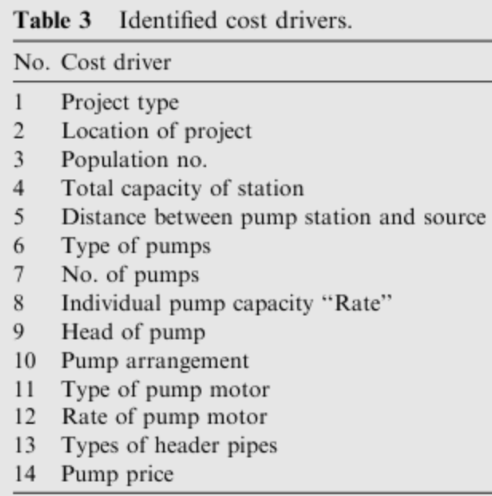
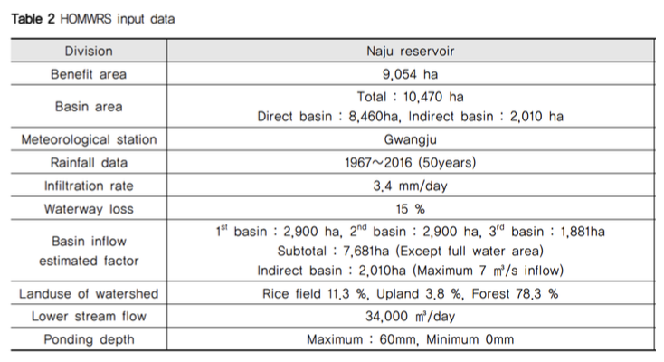

# Week 11_Background Research

- Finding the Best Location for Pumping Stations in the Galovica Drainage Area of Serbia: the AHP Approach for Sustainable Development
    
    The study aimed to determine the optimal location for pumping stations in the Galovica drainage area of Serbia, using the Analytic Hierarchy Process (AHP) method for sustainable development. AHP is a multi-criteria decision-making tool that considers both qualitative and quantitative factors.
    
    The researchers identified six criteria for determining the best location:  **land use, water quality, hydraulic capacity, energy efficiency, construction costs, and maintenance costs**.
    
- DROUGHT MANAGEMENT OF EXISTING WATER SUPPLY SYSTEM
    
    The article presents the steps taken by Melbourne's water supply system to manage drought, including increasing storage capacity, reducing water demand through water conservation and efficiency measures, and implementing alternative water sources such as desalination and recycled water.
    
    - **water demand of the region**
    - **net revenue: water selling cost, electrical cost for pumping water**
    
- A case-based reasoning approach for estimating the costs of pump station projects
    
    The study proposes a case-based reasoning (CBR) approach for estimating the costs of pump station projects. The study found that the CBR approach was able to accurately estimate the costs of pump station projects, with an average error of 4.9%. 
    
    Some typical factors and components which may be included in a reliability and availability evaluation are as follows: 
    **(1) Water demand and emergency storage.
    (2) Preventative maintenance.
    (3) Wear/life expectancy of subcomponent.
    (4) Repair.
    (5) Power transmission.
    (6) Parallel operation and stand-by equipment.
    (7) Emergency power.
    (8) Surge protection.
    (9) Pumps, valves and piping
    (10) Motors.
    (11) Controls.
    (12) Time factors.**
    
    Cost factors of pump station:
    
    
    
    
- Water Supply Alternatives for Drought by Weather Scenarios Considering Resilience: Focusing on Naju Reservoir
    
    유역특성을 활용한 물수지 분석: 
    
    분석 자료를 통해 산출된 필요수량과 공급가능수량으로 물 부족량을 산출하였, 이를 토대로 초기 저수율별 임시대책 (관정개발, 양수기 설치)과 항구대책 (말단 물 부족지역 양수장 신설, 영산강-나주호 연계 양수저류)으로 나누어 비교하여 대안을 평가하였다.
    
    
    
- 농림축산식품부 다목적농촌용수개발사업 환경평가 보고서
    
    분야:
    
    - 생물 다양성. 서식지 보전
    - 지형 및 생태축 보전
    - 주변 자연 경관에 미치는 영향
    - 수환경의 보전
    - 환경기준 부합성: 기상 및 대기질, 토양, 소음-진동
    - 환경 기초시설의 적정성
    - 자원 에너지 순환 효율성
    - 사회경제환경과의 조화성
    
    [다목적 농촌용수 개발사업 평가서 링크](https://www.mafra.go.kr/bbs/mafra/67/231230/download.do)
   
